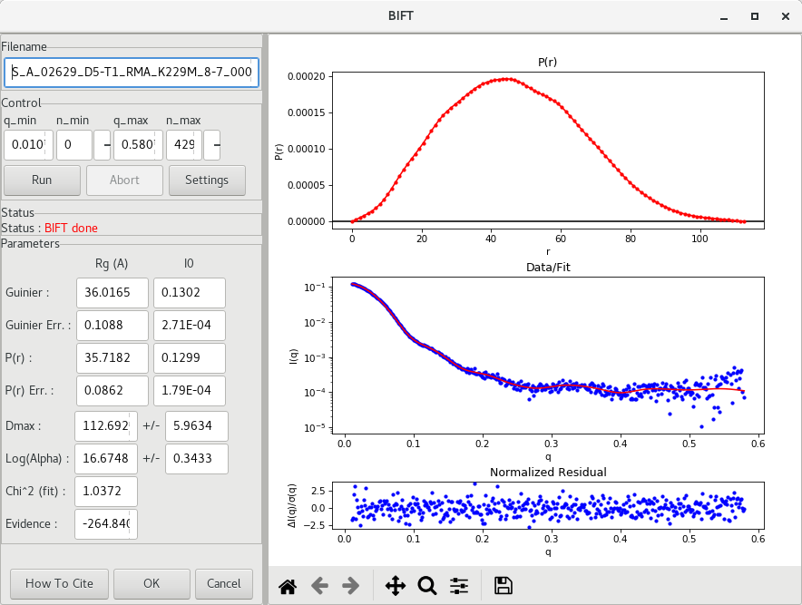

---
title: Advanced SAXS data processing
author: Normand Cyr
date: 2019-07-02
...

# Advanced data processing

## Pairwise distribution

Once a proper [Guinier analysis](../basic_data_processing/#guinier-analysis) is achieved and there is no indication of molecular aggregation or repulsion, the calculation of the pairwise distribution function \(P(r)\), the inverse Fourier transform (IFT) of \(I(q)\) *vs* \(q\), is the next step in the analysis of the SAXS data.  Several softwares have been developped, including [GNOM](./#gnom) and the [Bayesian IFT](./#BIFT) approaches.

The \(P(r)\) function describes the distribution of all electron-pair distances within the sample. This function will be characteristic of the shape of the sample. An illustration taken from [Mertens and Svergun (2010)] is given below.

From the \(P(r)\) function, both \(R_g\) and \(D_{max}\) can be determined using the full range of \(q\) experimental data. Here, \(D_{max}\) represents the maximum diameter in the sample particle. Globular samples will have a \(P(r)\) function with a single peak (black curve), and the more spherical the particle, the more symmetric will the \(P(r)\) function be. Alternatively, irregular, or elongated particles, will have a longer "tail" at large \(r)\) (see the cyan curve above) and may exhibit multiple peaks in the function (see the green curve above).

### GNOM

The most common such method is implemented in the GNOM program from the ATSAS package ([Franck *et al.* 2017]). In RAW, using the buffer-substracted data (`S_A_<experiment_number><sample_name>` file), the software can be accessed with a right-click on the filename and choosing the option `IFT (GNOM)`. A new window will open and a \(P(r)\) function will be generated (top plot), along with the corresponding fit to the experimental data (bottom plot).

Initial approximations of \(I(0)\), \(R_g\) and \(D_{max}\) values are reported, along with their uncertainties. The [previously obtained](../basic_data_processing/#guinier-analysis) Guinier approximation results are reported also so one can compare the results of the different approaches. They generally should agree well.

An assessment of the quality of the function is nonetheless important. GNOM will report a *total estimate*, which varies from 0 (no agreement between experimental data and the fit) to 1 (perfect match). A quick way to verify is also to read the *GNOM says* output. Depending on the total estimate, GNOM will say *Excellent*, *Good*, *Reasonable* or *Suspicious*. Any result being suspicious should be analyzed carefully and is likely not of good quality to move forward in the processing of the data.

It is important when using GNOM to look for suspicious results. For example, the \(P()r\) function should reach zero "smoothly" at \(D_{max}\). By default, the option `Force to 0 at Dmax` is set to `Y`. One way to verify this is to set `Force to 0 at Dmax` to `N` and observe the shape of the curve at \(D_{max}\). For high quality data, the function will get to 0 whether it is forced or not. It is also possible to change the value of `q_max` in order to exclude erronous data at high `q`.

### BIFT

A Bayesian approach for calculating the pairwise distribution function \(P(r)\), first proposed by [Hansen (2000)], is another way of calculating the pairwise distribution function \(P(r)\). In RAW, using the buffer-substracted data (`S_A_<experiment_number><sample_name>` file), the software can be accessed with a right-click on the filename and choosing the option `IFT (BIFT)`. A new window will open and a \(P(r)\) function will be generated (top plot), along with the corresponding fit to the experimental data (bottom plot).

Similar to the output of GNOM, values of \(I(0)\), \(R_g\) and \(D_{max}\) are reported, along with their uncertainties. This method has the advantage of having only one solution, and parameters cannot be adjusted. The [previously obtained](../basic_data_processing/#guinier-analysis) Guinier approximation results are reported also so one can compare the results of the different approaches. They generally should agree well.

One caveat of the BIFT method is that the output file is not compatible with [DAMMIF](../modelling_with_dammif/) for dummy atom modelling, but can be used for [DENSS](../modelling_with_denss/) for electron density modelling.

[Franck *et al.* 2017]: https://www.ncbi.nlm.nih.gov/pubmed/28808438
[Hansen (2000)]: https://doi.org/10.1107/S0021889800012930
[Mertens and Svergun (2010)]: https://www.ncbi.nlm.nih.gov/pubmed/20558299
