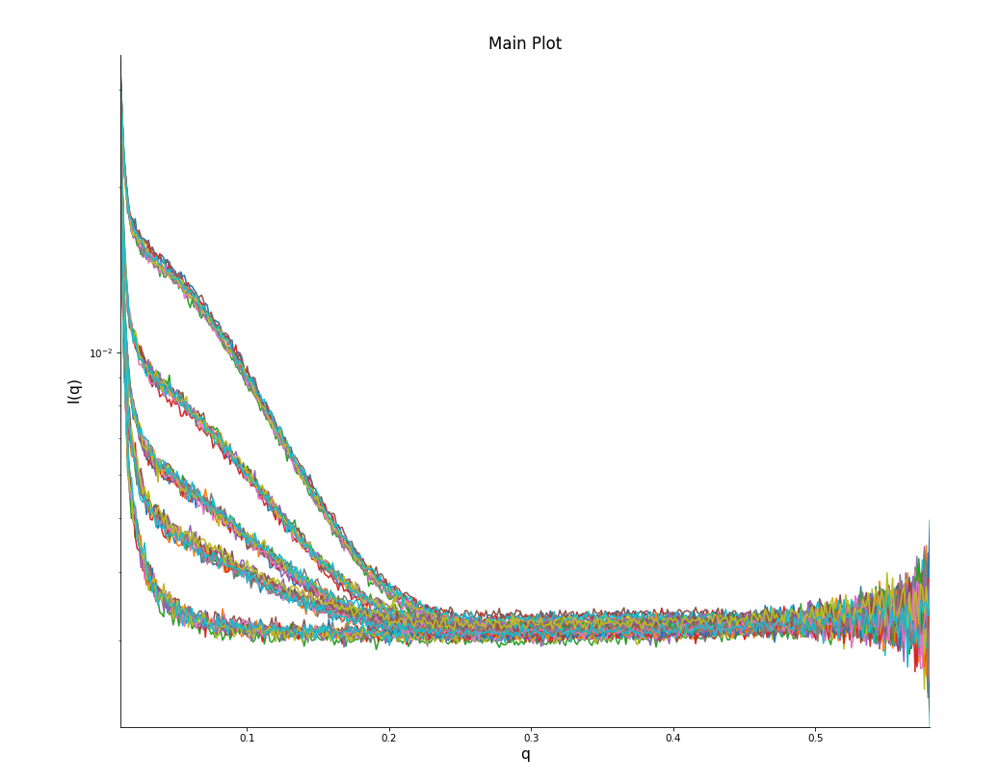
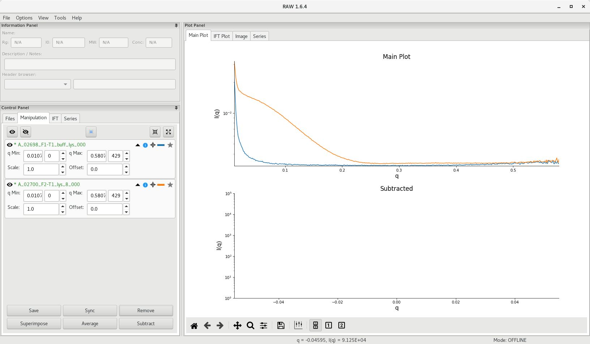
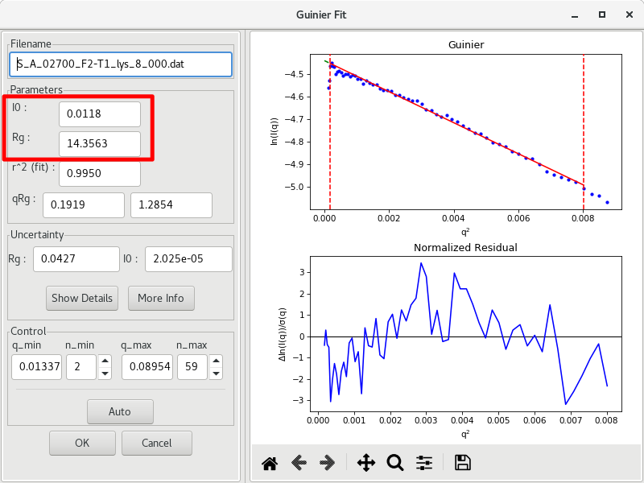

---
title: Basic SAXS data processing
author: Normand Cyr
date: 2019-05-10
...

# Basic data processing

## Plotting the data

In RAW, go to the folder where the radial averaging data from the corrected SAXS images is saved. Using the standard folder hierarchy at the Structural Biology Platform, the `.dat` files will be in

`<project_name>/scattering_data/processed/`

Select the data files you want to plot in the file browser, then click on `Plot`. The individual scattering curves will be plotted on the right, in the Main Plot area as illustrated below.

If you have tested multiple concentrations (you should have!), you show see the effect of concentration on the scattering intensity.

## Averaging multiple acquisitions

Multiple acquisitions of equal duration (typically 5 to 10 acquisitions) are typically performed in order to be able to detect, and discard, data affected by radiation damage (a single, long, acquisition will mask such effect). The data can then be averaged and scattering curves differing significantly can be discarded. To do this in RAW, select the curves to average and click on `Average` to perform the operation.

The average scattering profile will appear in RAW and `A_` will be added at the beginning of the file name.

*Note: If certain curves are significantly different, RAW will open a dialog box and ask whether this/these profile(s) should be discarded from the rest of the group. It is important at this point to inspect the individual curves for suspicious divergence from the mean.*

## Buffer subtraction

Because SAXS is a contrast method where the scattering signal is obtained from the difference in electron density between a molecule in solution and bulk solvent, scattering resulting from the buffer has to be subtracted from the measured scattering of the sample to isolate the sole contribution from the molecule. This is done in RAW by subtracting the averaged buffer scattering curve from the averaged sample scattering curve.

scattering profile = sample scattering - buffer scattering

Select the buffer curve by clicking on the star of the file name, then select the sample curve then click on `Subtract`.

The subtracted scattering profile will appear in the lower panel of RAW and `S_` will be added at the beginning of the file name.

At this point, it is recommended to save the averaged and subtracted curves. This can be done in RAW by selecting the curve in the `Manipulation` tab and clicking on the `Save` button. Using the standard folder hierarchy at the Structural Biology Platform, the `.dat` files for averaged curves should be saved in

`<project_name>/scattering_data/averaged/`

and the `.dat` files for subtracted curves should be saved in

`<project_name>/scattering_data/subtracted/`

### Detecting buffer mismatch

Source: [Skou *et al* 2014]

When the data is plotted as a Kratky plot (right curve) (more on the Kratky analysis [below](#kratky-analysis)), the effect is enhanced (note the green curve - oversubtracted - reaching large negative \(y\) values at medium and high \(q\)).

## Guinier analysis

The Guinier approximation is the first analysis step to perform following the acquisition of the data and buffer subtraction in order to assess the quality of the data. Visually, one can detect if the sample presents pathologies in terms of:

- lack of monodispersity
- particles aggregation or repulsion
- extreme deviations from globularity
- concentration-dependent scattering effects.

The Guinier approximation states that, at low \(q\):

$$I(q)\approx I(0)\exp{\frac{-q^2{R_g}^2}{3}}$$

A Guinier plot is contructed by plotting \(\ln{I(q)}\) against \(q^2\). Problematic sample behaviour will exhibit a non-linear trend towards low \(q\), where aggregation will be represented by an upward curve whereas a downward curve will be typical of particles repulsion.

Source: [Putnam *et al* (2007)]

Both the radius of gyration \(R_g\) (defined as the square root of the average distance of each scatterer from the molecule center) and the scattering intensity at zero angle \(I(0)\) (*ie* forward scattering, when \(q=0\)) can be extracted from the Guinier plot. The slope of the curve is given by \(\frac{-R_g^2}{3}\) and the vertical intercept (at \(q=0\)) will correspond to \(\ln{I(0)}\).

### Guinier plot in RAW

To get a Guinier plot of the subtracted data (`S_A_<experiment_number><sample_name>` file), select the subtracted curve, then right-click and choose the `Guinier Analysis` option. A new window will open and an initial Guinier plot will be generated using AutoRG, and \(I(0)\) and \(R_g\) are reported, along with their uncertainties, as well as the \(q{R_{g}}_{min}\) and \(q{R_{g}}_{max}\) values.

For globular proteins, it is important to aim for \(q{R_{g}}_{max}<1.3\). It is possible that the returned values from AutoRG are a little off, or that the algorithm included initial points that diverge significantly from the linear trend. Manual intervention is possible by changing the \(q_{min}\) (or \(n_{min}\)) and \(q_{man}\) (or \(n_{man}\)) values used for the Guinier fit.

When you are done, click on `OK` and write down the results (\(R_g\) and \(I(0)\), and their respective uncertainties) and the parameters used to generate the Guinier fit (\(r^2\) of the fit, \(q_{min}\), \(q_{max}\), \(q{R_{g}}_{min}\) and \(q{R_{g}}_{max}\). These values are typically reported in the literature when SAXS data is published.

## Molecular weight analysis

If the sample does not exhibit an aggregation or repulsion behaviour at high (or low) concentrations, a plot of \(I(0)\) *vs* sample concentation will give a linear correlation, and will not be affected by particle shape (\(R_g\) should remain relatively constant). In fact, in terms of absolute scale, \(I(0)\) corresponds to the square of the number of electrons in the scattering sample.

Practically, the scattering intensity \(I(q)\) is measured on a relative scale and one can use a sample of known molecular weight as standard. For example, for proteins, lysozyme (14.3 kDa) and monomeric EGFP (26.9 kDa) (as illustrated by [Myatt *et al.* 2017]) are routinely used at the Structural Biology Platform and recent scattering data at precise concentration are be readily available for standardization. From the \(I(0)\) determined using the Guinier analysis above, and the \(I(0)\) of a standard sample, the molecular weight of the sample \(M_{sample}\) can be calculated using the following equation:

$$\frac{I(0)_{sample}}{I(0)_{standard}}=\frac{C_{sample}\times{M_{sample}}}{C_{standard}\times{M_{standard}}}$$

## Kratky analysis

One way to verify the folding of a sample is to plot the data as \(q^2I(q)\) *vs* \(q\). This is called a Kratky plot and can simply be generated in RAW by right-cliking on the subtracted data plot and changing the \(y\)-axis to \(q^2I(q)\).

A folded sample will display a parabolic curve in the low \(q\) region, whereas an unfolded sample will display a more linear curve, with a less distinctive shape.

Source: [Putnam *et al* (2007)]

[Myatt *et al* 2017]: https://content.iospress.com/articles/biomedical-spectroscopy-and-imaging/bsi167
[Putnam *et al* (2007)]: https://www.ncbi.nlm.nih.gov/pubmed/18078545
[Skou *et al* 2014]: https://www.ncbi.nlm.nih.gov/pubmed/24967622
