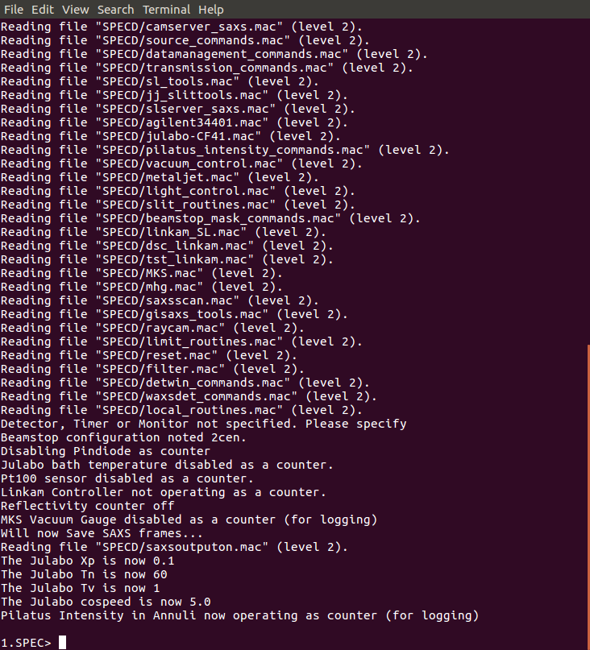
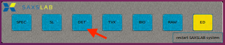
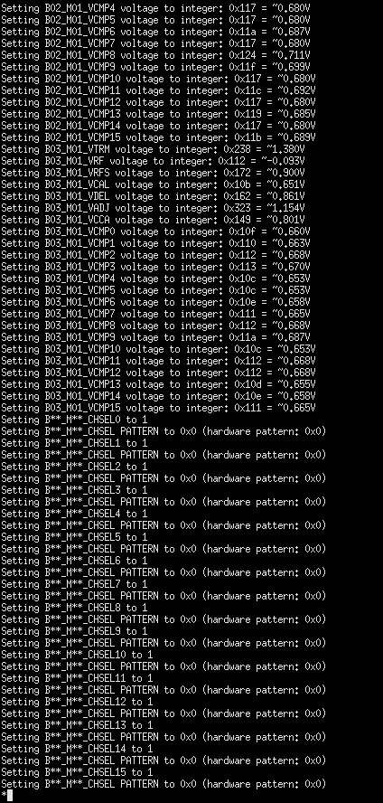
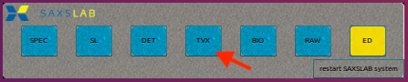
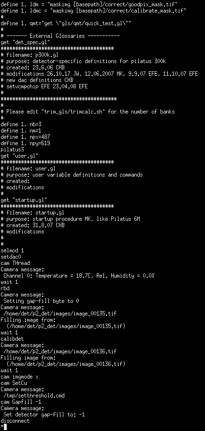
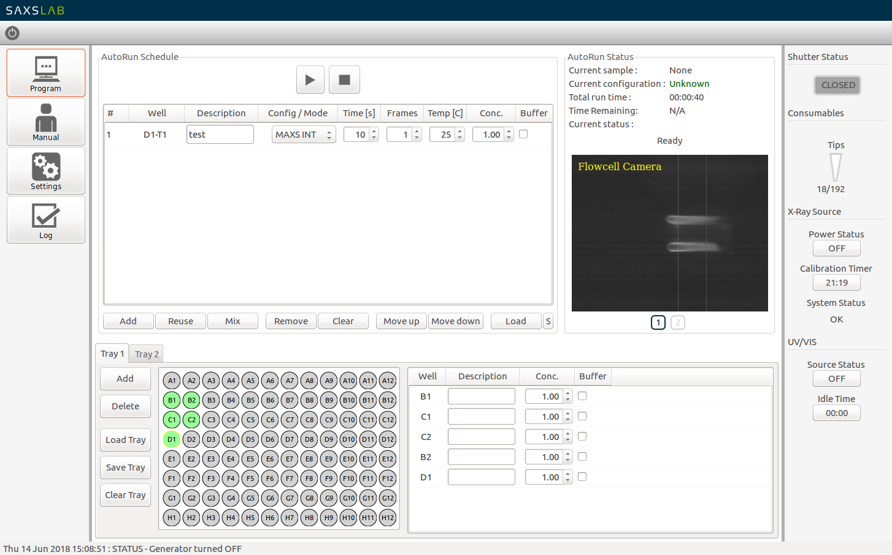
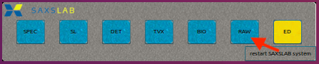
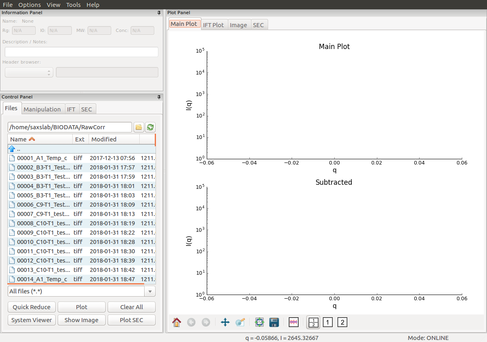

---
title: Software used by the instrument
author: Normand Cyr
date: 2020-04-17
...

# Software used by the instrument

Several pieces of software are in place in order to control the various pieces of the BioSAXS instrument. The toolbar to open them is located at the bottom of the screen and looks like the following:


Each button is responsible for opening a different software.

| Button | Software                                                  |
|--------|-----------------------------------------------------------|
| SPEC   | spec software for instrument control and data acquisition |
| SL     | detector data processing                                  |
| DET    | detector camera logging                                   |
| TVX    | detector control software                                 |
| BIO    | BioSAXS instrument control                                |
| RAW    | BioXtas RAW for data visualization and analysis           |
| ED     | `gedit` text editor                                       |

If a button is yellow, it means the software is closed, whereas a blue button indicates that the corresponding software is open. By clicking the blue-colored button, you will be directed to the corresponding window.

*Note: in case that the toolbar is not present, it can be opened manually by clicking on the `Ganesha System Control Panel` on the desktop.*


## SPEC

SPEC is the terminal software used to communicate between the various other software and the instrumental hardware of the BioSAXS (shutter, detector *etc*.). A terminal window should be open on the desktop. If not, SPEC can be started from the shortcut bar located at the bottom of the screen, by clicking on SPEC.


This will load the following terminal:



Commands can then be typed to operate the instrument. For example:

```
1.SPEC> o_shut
Opening Shutter

2.SPEC> ct 0.1

Thu Jun 14 17:26:37 2018

     Seconds = 0.101
  PilatusInt = 2.79968E07 (2.8E08/s)

3.SPEC> c_shut
Closing Shutter

```

will open the shutter, measure the beam count for 0.1 second and then close the shutter. We expect a photon flux of \(2.5 \times 10^8 s^{-1}\) or more. Nonetheless, normally, there should not be any input from the regular users in this terminal.


## DET

DET is the terminal software logging what happens with the detector. It can be opened via the shortcut bar located at the bottom of the screen, by clicking on DET.



This will load the following terminal:




## TVX

TVX is the terminal software handling the images, including taking care of corrections, applying masks *etc*. It can be opened via the shortcut bar located at the bottom of the screen, by clicking on TVX.



This will load the following terminal:




## BIO

BIO is the actual software used to control the robot and perform the SAXS experiments. It can open opened via the shortcut bar located at the bottom of the screen, by clicking on BIO.


This will load the following window:




## RAW

RAW is the analysis software used to analyze the SAXS data collected on the instrument. Recorded images and resulting scattering profiles will be displayed live in this window. It can open opened via the shortcut bar located at the bottom of the screen, by clicking on RAW.



This will load the following window:


