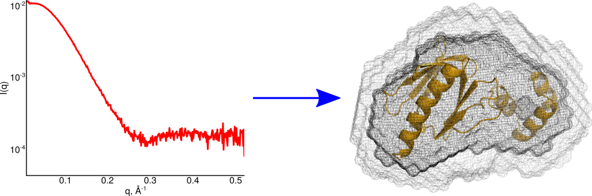

---
title: Home of the SAXS tutorial
author: Normand Cyr
date: 2020-04-06
...

# Welcome to the SAXS tutorials

For information about the Structural Biology Platform, visit our [website](https://biochimie.umontreal.ca/en/scientific-platforms-bmm/structural-biology/).

To reserve time on the BioSAXS, fill up this [form](https://biochimie.umontreal.ca/wp-content/uploads/sites/37/2018/10/SAXS_time_request.pdf) and send it to the Structural Biology Platform manager, Normand Cyr, by [email](mailto:normand.cyr@umontreal.ca).

## What is SAXS?

Small-angle X-ray scattering (SAXS) is a technique used to derive low resolution structural information about the shape, size, electronic density, molecular weight and conformational changes of macromolecules in solution by taking advantage of the scattering intensities at different angles.

## Tutorial sections

- Instrumentation:
    - [Overview of the instrumentation](overview_instrumentation.md) - to be familiar with the equipment in the laboratory
    - [Softwares](details_instrument_softwares.md) - softwares used by the instrument
    - [Maintenance](maintenance.md) - basic maintenance procedures
- SAXS experiment:
    - [Running a SAXS experiment](saxs_experiment.md) - first steps into data acquisition
    - [SEC-SAXS setup](sec-saxs_setup.md) - data acquisition in SEC-SAXS mode
- Data processing:
    - [Basic processing of SAXS data](basic_data_processing.md) - initial data analysis and sample quality assessment
    - [Advanced processing of SAXS data](advanced_data_processing.md) - calculation of the pairwise distribution function
    - [Dealing with SEC-SAXS data](sec-saxs.md) - analyzing your SEC-SAXS data
- *Ab initio* modelling:
    - [Modelling with DAMMIF](modelling_with_dammif.md) - dummy atom modelling from SAXS data using DAMMIF
    - [Modelling with DENSS](modelling_with_denss.md) - electron density modelling from SAXS data using DENSS

## References for this tutorial

### Demonstration data

If you would like to explore this tutorial with demonstration data, you can download these datasets:

- [lysozyme dataset](https://github.com/BioStruct-UdeM/lysozyme_SAXS_tutorial_data/archive/v1.1.zip) (ZIP file) for batch mode analysis. More experimental details and data organization on the [GitHub page](https://github.com/BioStruct-UdeM/lysozyme_SAXS_tutorial_data).
- [BSA dataset](https://github.com/BioStruct-UdeM/BSA_SEC-SAXS_tutorial_data/archive/v1.0.zip) (ZIP file) for SEC-SAXS analysis. More experimental details and data organization on the [GitHub page](https://github.com/BioStruct-UdeM/BSA_SEC-SAXS_tutorial_data).

### Softwares required

The instructions on how to install individual softwares on your personal computer are details on their respective websites.

- [BioXTAS RAW](https://bioxtas-raw.readthedocs.io/en/latest/index.html)
- [ATSAS manuals](https://www.embl-hamburg.de/biosaxs/manuals/)
- [DENSS manual](https://www.tdgrant.com/denss/tutorial/)

Alternatively, the Structural Biology Platform has computers available where recent versions of these softwares are installed. Access to the computer room is controlled by access codes. Contact [Normand Cyr](maito:normand.cyr@umontreal.ca) in order to obtain a code.

### Scientific literature

- [Jeffries CM, *et al* (2016)](http://doi.org/10.1038/nprot.2016.113). Preparing monodisperse macromolecular samples for successful biological small-Angle X-ray and neutron-scattering experiments. *Nature Protocols*.
- [Putnam CD, *et al* (2007)](https://doi.org/10.1017/S0033583507004635). X-ray solution scattering (SAXS) combined with crystallography and computation: defining accurate macromolecular structures, conformations and assemblies in solution. *Quarterly Reviews of Biophysics*
- [Skou S, *et al* (2014)](https://doi.org/10.1038/nprot.2014.116). Synchrotron-based small-angle X-ray scattering of
proteins in solution. *Nature Protocols*.
- [Trewhella J, *et al* (2017)](https://doi.org/10.1107/S2059798317011597). 2017 publication guidelines for structural modelling of small-angle scattering data from biomolecules in solution: an update. *Acta Crystallographica Section D*.
