---
title: Maintenance procedures
author: Normand Cyr
date: 2020-04-17
...

# Maintenance

## X-ray source

### Control software

The Excillum MetalJet controller software can be accessed via a remote desktop application (*eg* TeamViewer or VNCviewer) at the IP address `172.117.1.3`. The following window should appear:

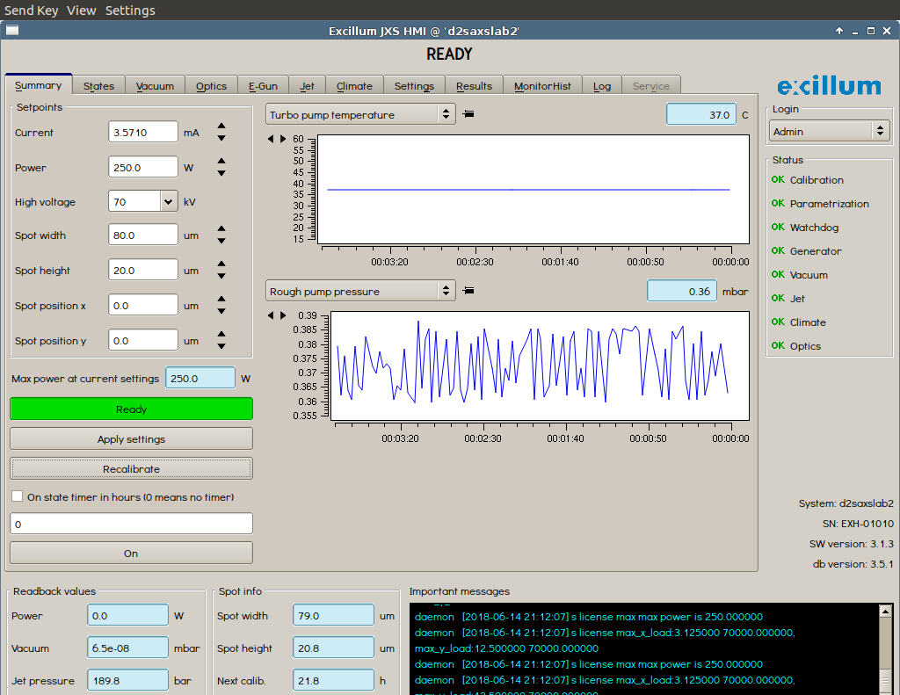

The total operating time of the MetalJet cathode will be found in the **E-Gun** tab:

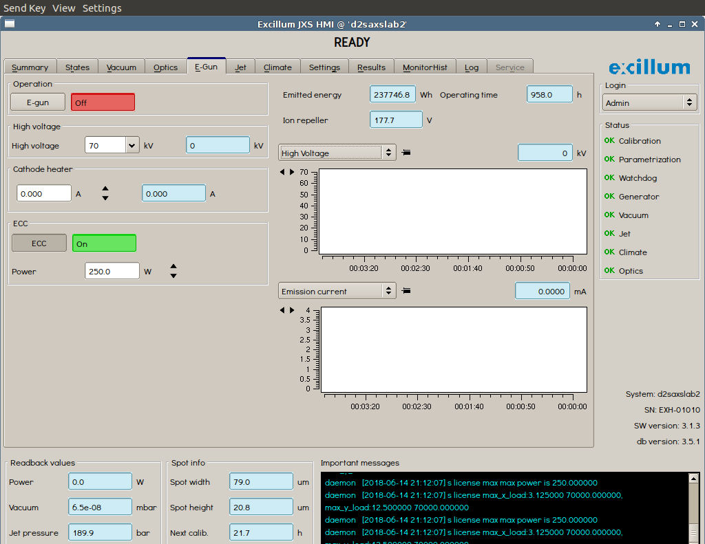

### Replacing the cathode

TBD

## BioSAXS instrument

### Software

Several pieces of software are in place in order to control the various pieces of the BioSAXS instrument.

#### SPEC

SPEC is the terminal software used to communicate between the various other software and the instrumental hardware of the BioSAXS (shutter, detector *etc*.). A terminal window should be open on the desktop. If not, SPEC can be started from the shortcut bar located at the bottom of the screen, by clicking on SPEC.

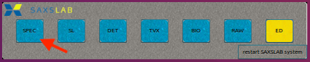

This will load the following terminal:

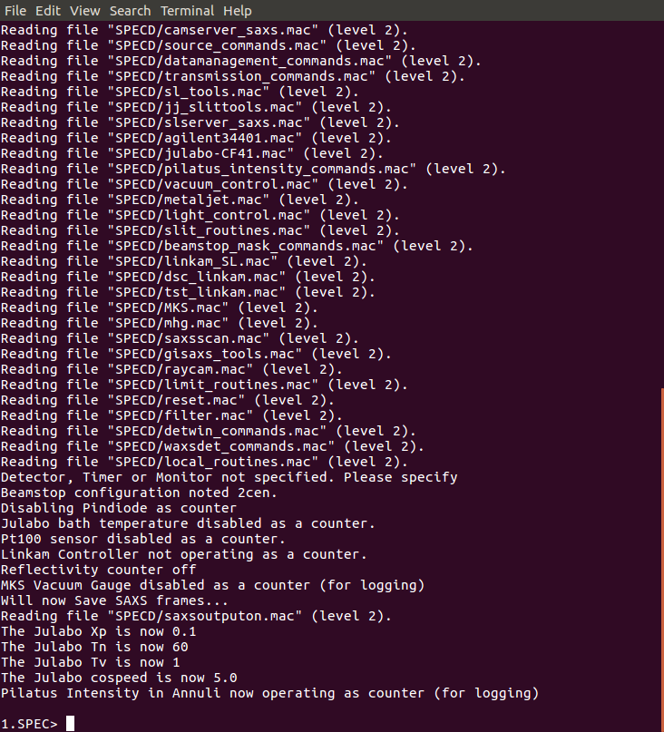

Commands can then be typed to operate the instrument. For example:

```
1.SPEC> o_shut
Opening Shutter

2.SPEC> ct 0.1

Thu Jun 14 17:26:37 2018

     Seconds = 0.101
  PilatusInt = 2.79968E07 (2.8E08/s)

3.SPEC> c_shut
Closing Shutter

```

will open the shutter, measure the beam count for 0.1 second and then close the shutter

#### DET

DET is the terminal software logging what happens with the detector. It can be opened via the shortcut bar located at the bottom of the screen, by clicking on DET.

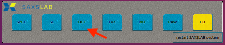

This will load the following terminal:

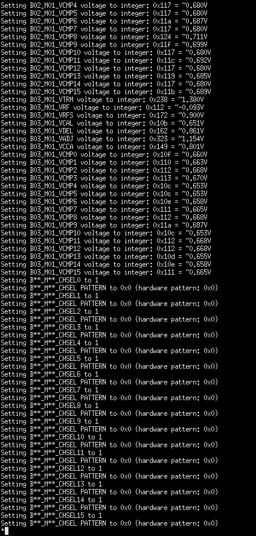

#### TVX

TVX is the terminal software logging what happens with the detector. It can be opened via the shortcut bar located at the bottom of the screen, by clicking on TVX.

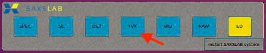

This will load the following terminal:

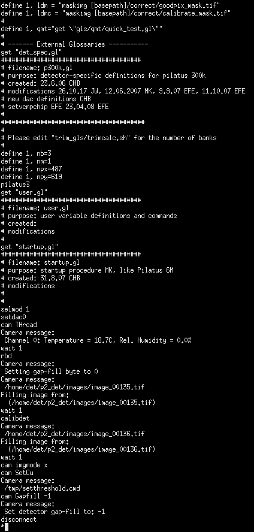

#### BIO

BIO is the actual software used to control the robot and perform the SAXS experiments. It can open opened via the shortcut bar located at the bottom of the screen, by clicking on BIO.

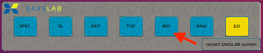

This will load the following window:

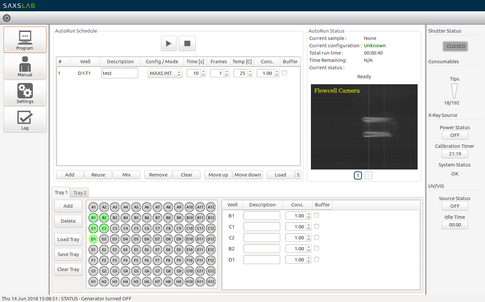

#### RAW

RAW is the analysis software used to analyze the SAXS data collected on the instrument. Recorded images and resulting scattering profiles will be displayed live in this window. It can open opened via the shortcut bar located at the bottom of the screen, by clicking on RAW.

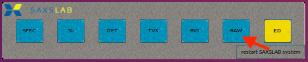

This will load the following window:

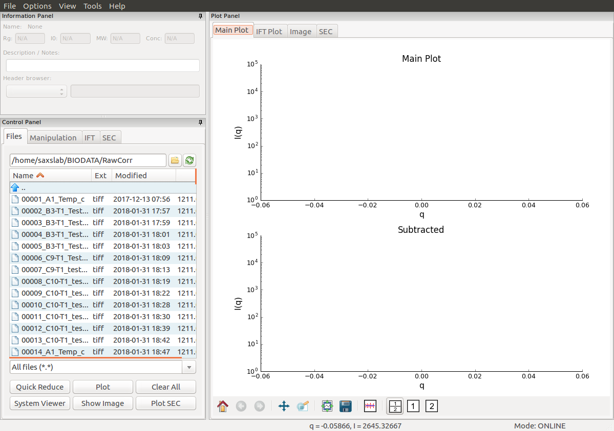

## Changing the capillary

On occasional basis, the capillary needs to be replaced. The steps below will describe the sequence of events to follow.

### Venting the instrument

In the SPEC window type `vent_system`. This will release the vacuum from the detector chamber. Once it is done, open the black valve located at the end of the detector chamber to equilibrate the detector chamber pressure to atmospheric pressure.

**PICTURE OF THE BLACK VALVE**

Once the reading on the digital pressure sensor corresponds to atmospheric pressure  (*ie* around 1000 mbar), the black valve should be closed back to keep the detector chamber dry.

**PICTURE OF THE DIGITAL PRESSURE SENSOR**

### Extracting the capillary assembly out

Unscrew the two securing screws on the front of the sample robot and move the robot by 15 cm to the right. This will free some space to access the sample funnel. In order to remove the sample funnel, using a 3 mm hexagonal key, unscrew the two bolts holding the funnel in place. Be careful that the two o-rings inside the funnel stay in place.

**PICTURE**

Moving to the other side of the instrument, first remove the liquid outlet tube by unscrewing the beige connector, then unscrew the two bolts holding the beige capillary holder in place.

**PICTURE**

Carefully pull the capillary assembly out by sliding it towards you. If the assembly does not move, go on the other side of the instrument and gently push the assembly by about 1 cm in order to facilitate the removal.

Then once the capillary assembly has been removed along with the capillary holder, pull carefully, yet firmly, the holder apart from the assembly. Inspect the capillary for the presence of cracks, salt deposits or dirty parts.

**PICTURE**

### Putting a new capillary assembly in

In order to install a new capillary assembly, first write the installation date with a fine marker on the side of the metal part of the new capillary assembly. This will enable tracking the age of the capillary.

Install the beige holder onto the right side of the capillary assembly. Note the three straight notches on both the holder and the capillary assembly. Make sure they match when put together.

**PICTURE**

Repeat the extracting steps outlined above in the reverse order. Make sure the o-rings remain in place inside the sample funnel and that both the holder and the sample funnel are screwed firmly and that both lay flat on the instrument.

### Evacuation the instrument

Make sure the black valve located at the end of the detector chamber is closed then in order to apply vacuum to the detector chamber, in the SPEC terminal, type `evacuate_system`. The vacuum pump will start and pressure should go down rapidly. Expect the vacuum to be reached (< 1 x 10<sup>-1</sup> mbar) within 2-3 minutes. In the contrary, there may be a leak somewhere.

Slide the robot back in place and secure it with its two black screws.
