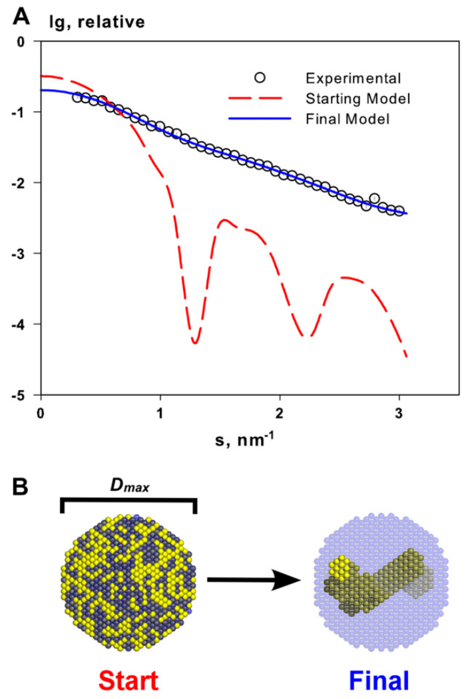
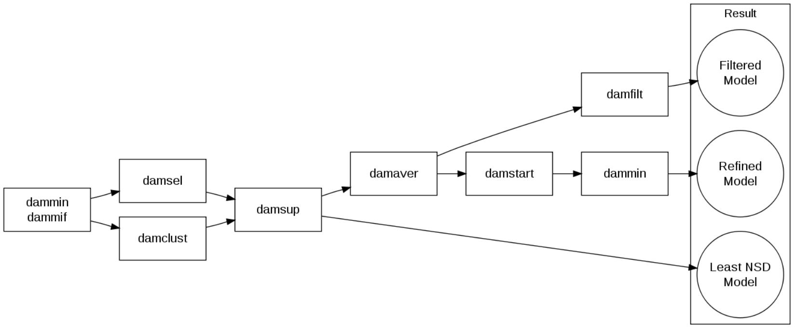
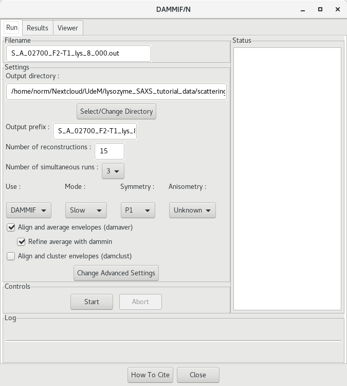
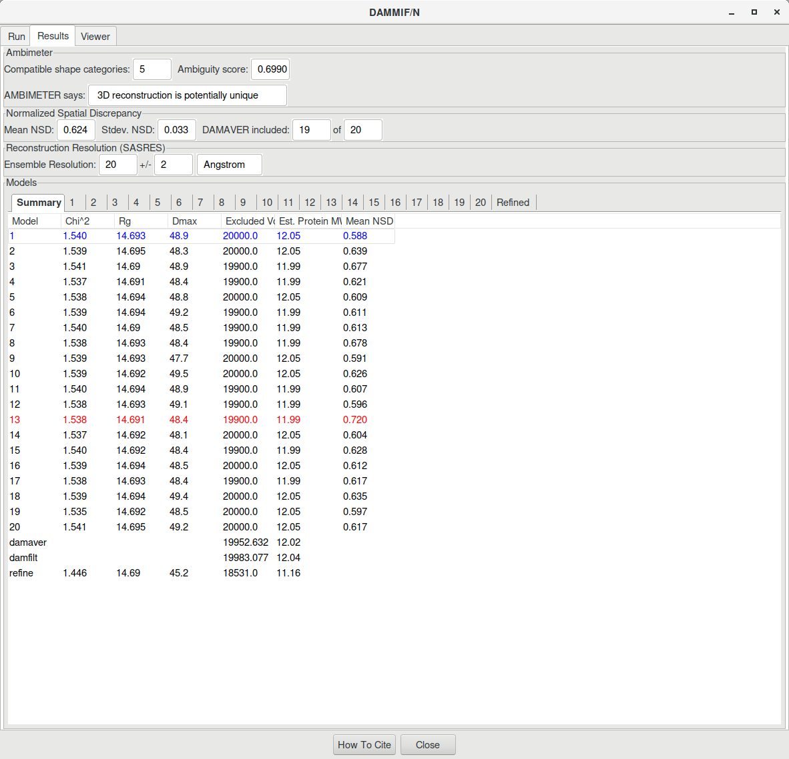
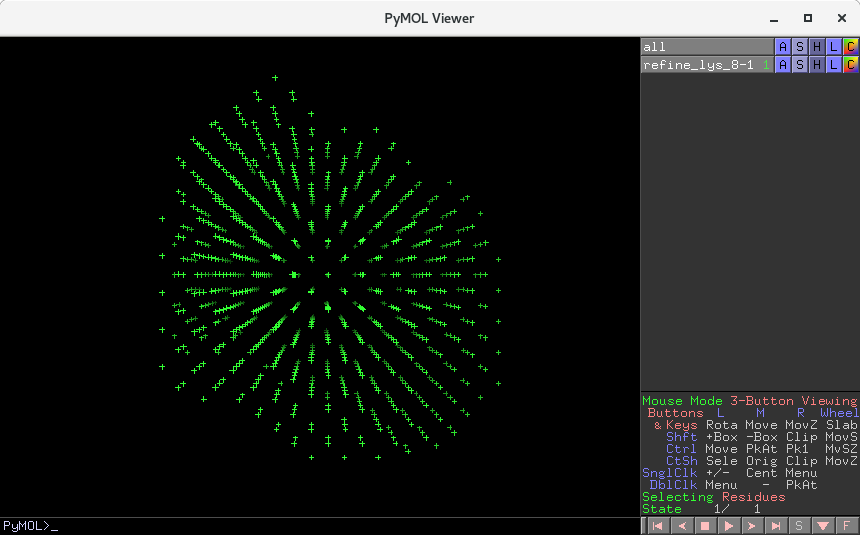
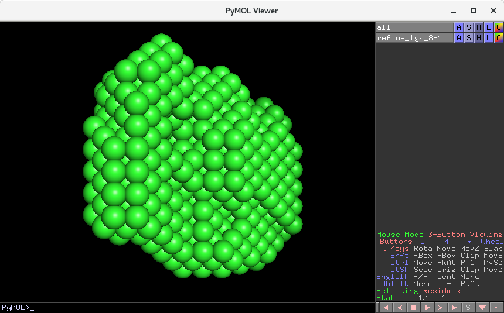
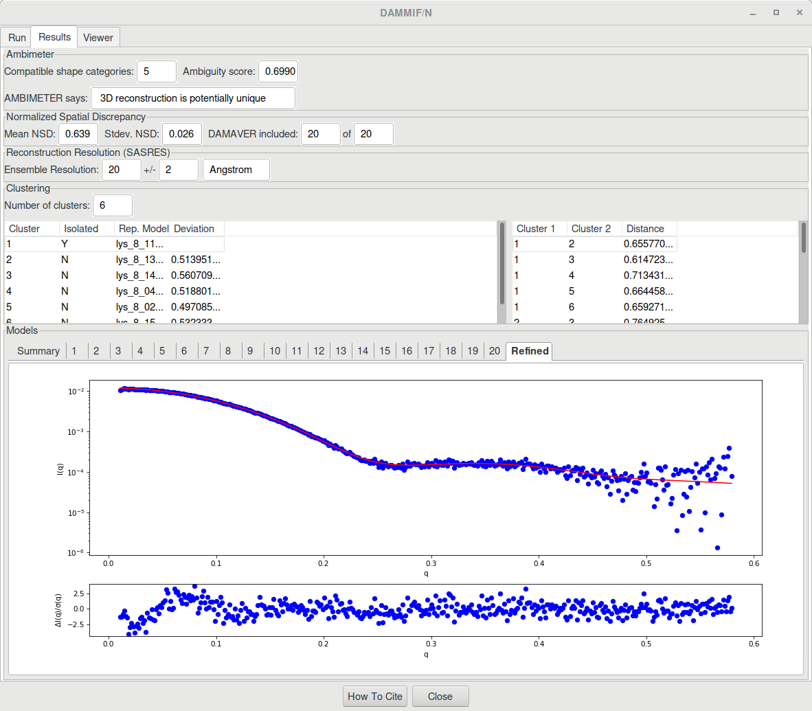

---
title: Modeling with DAMMIF
author: Normand Cyr
date: 2020-04-17
...

Several pieces of software described here are also available on [ATSAS online](https://www.embl-hamburg.de/biosaxs/atsas-online/) (registration required).


# Dummy atoms bead modeling with DAMMIF

Dummy atoms bead modeling is used to generate 3D models corresponding to experimental SAXS data.



Source: [Mertens and Svergun 2010](https://www.ncbi.nlm.nih.gov/pubmed/20558299)

Citing the manual of DAMMIF, the general process goes as follow:

> In bead modeling a particle is represented as a collection of a large number of densely packed beads inside a search volume. Each bead belongs either to the particle or to the solvent. Starting from an arbitrary initial model DAMMIF utilizes simulated annealing to construct a compact interconnected model yielding a scattering pattern that fits the experimental data.

More details, and the official manual for ATSAS DAMMIF can be found [here](https://www.embl-hamburg.de/biosaxs/manuals/dammif.html).


## Overview of the process



Source: [Franke 2012](https://www.embl-hamburg.de/biosaxs/courses/embo2012/slides/ab-initio-tutorial-franke.pdf)


## DAMMIF/DAMMIN via RAW

RAW offers a nice GUI for running *ab initio* dummy atom modeling from SAXS data. If you rather run DAMMIF *et al.* from the command prompt, go to the [next section](modeling_with_dammif.md#dammifdammin-via-the-command-prompt). Otherwise, in RAW, right-click on the GNOM `.out` file and select `Bead Model (DAMMF/N)`. This will open a new dialog window.



Change the output directory to the DAMMIF directory

`<project_name>/processed_data/DAMMIF/`

You can also change the prefix name. At this point, file names will become very long! Other parameters to adjust, depending on the quality of the model and time you want to invest, include:

| "Type" of modeling       | Quick and dirty |  Good | Ultimate |
|---------------------------|-----------------|-------|----------|
| Time to calculate         |     Minutes     | Hours |   Days   |
| Number of reconstructions |        10       |   20  |    100   |
| Mode                      |       Fast      |  Slow |   Slow   |
| Refinement with DAMMIN    |        no       |  yes  |    yes   |
| Clustering with DAMCLUST  |        no       |   no  |    yes   |


Then click on `Start` to initiate the calculations. This will take some time, depending on the complexity of your sample and the speed of the processor of your computer (CPU). We recommend that you run these on one of our Linux machine in the computers room.

Please keep in mind that a "quick and dirty" modeling approach will **not** yield a publication quality model. The objective here is to quickly generate a dummy atoms model in order to give a broad idea of the shape of the molecule investigated. The `Fast` mode uses larger bead atoms and the cooling time during the annealing step is faster. It will therefore likely generate a lower accuracy model.

### DAMMIF with refinement

DAMMIF generates several models trying to fit the experimental data. However, following selection (DAMSEL) and averaging (DAMAVER), the model will not fit the experimental data well. This bead model should therefore be refined via DAMSTART and DAMMIN (by selecting the `Refinement with DAMMIN` option).

More [below](#refinement-of-the-model-using-dammin).

The result will look like this:



RAW also outputs a CSV file (`lys_8_dammif_results.csv` in our case) containing the data presented in the table above. Additionally, a PDF file (`lys_8_dammif_results.pdf` here) is printed where the resulting SAXS profile of each model is fitted to the experimental data.

The log file of the DAMMIN procedure (`refine_lys_8.log`) will also contain the final Chi2 against the experimental data at the bottom (use the `tail refine_lys_8.log` command to only read the last lines of the log file):

```txt
Final Chi^2 against raw data ........................... : 1.446
```

The final, refined DAMMIF/N dummy atom model can be found at the file name `refine_lys_8-1.pdb` and can be visualized by your favorite molecular viewer (*e.g.* PyMOL).



In order to see the model with "beads", enter the following commands in the PyMOL prompt:

```PyMOL
hide all
show spheres
```



More about model visualization in the section [below](#visualization-of-the-models).


### DAMMIF with refinement and DAMCLUST

DAMMIF generates several models trying to fit the experimental data and can be further clustered in groups of similar shapes with DAMCLUST. This is relevant when several (20 or more) models are generated by DAMMIF, in order to provide representative models (there could be more than one possible solution!) and assess the ambiguity of the modeling results.



I suggest that you inspect the DAMCLUST log file (`lys_8_damclust.log` in the present case). You will find all the relevant information regarding clustering statistics:

```txt
Cluster  1 (isolated): lys_8_11-1.pdb
 Cluster  2 (representative, deviation): lys_8_13-1.pdb  0.51395155614075694
  The cluster contains 2 members. Equivalent model: lys_8_07-1.pdb
 Cluster  3 (representative, deviation): lys_8_14-1.pdb  0.56070984352458797
  The cluster contains 2 members. Equivalent model: lys_8_12-1.pdb
 Cluster  4 (representative, deviation): lys_8_04-1.pdb  0.51880126381182456
 Other cluster members:
 lys_8_16-1.pdb
 lys_8_01-1.pdb
 lys_8_05-1.pdb
 Cluster  5 (representative, deviation): lys_8_02-1.pdb  0.49708589875970327
 Other cluster members:
 lys_8_18-1.pdb
 lys_8_09-1.pdb
 lys_8_06-1.pdb
 Cluster  6 (representative, deviation): lys_8_15-1.pdb  0.53233381087953957
 Other cluster members:
 lys_8_20-1.pdb
 lys_8_03-1.pdb
 lys_8_19-1.pdb
 lys_8_10-1.pdb
 lys_8_17-1.pdb
 lys_8_08-1.pdb

 Distances between the representatives
       (Cluster1, Cluster2, Distance):
           1           2  0.65577070756240063
           1           3  0.61472311767972543
           1           4  0.71343199569634563
           1           5  0.66445856740754217
           1           6  0.65927117113398515
           2           3  0.76492541385778356
           2           4  0.60028264458406144
           2           5  0.79368600384055565
           2           6  0.59647682130412460
           3           4  0.69334851364429495
           3           5  0.56016424546682719
           3           6  0.70273685297916710
           4           5  0.69956301946692123
           4           6  0.57830157185833553
           5           6  0.66991966464588559
```

DAMCLUST will also generate an average model for each cluster. The averaged models of each cluster can then be refined with DAMMIN and used for structural analysis. This step needs however to be performed via the command prompt. See details [here](#refinement-of-the-model-using-dammin).


## DAMMIF/DAMMIN via the command prompt

*Will later be updated to use the files available in the tutorial*

### Initial DAMMIF calculations

DAMMIF uses the GNOM output file (the distance distribution function) as the main input file. It has two modes of operation (fast - large beads and slow - small beads) as well as an interactive mode (invoked by running only `dammif` without arguments).

The general command is

```bash
dammif --mode=fast lys_8.out
```

This will output a single bead model in PDB format along with a log file and numerical files containing fits to the experimental data. Generally speaking, it is common to calculation multiple models and then average the similar ones. This is done using a `for` loop in a `bash` script (see below).


Below is a typical `bash` script to determine 20 models simultaneously, in slow mode:

```bash
#!/bin/bash

# Variables used
GNOM_FILE_PREFIX="lys_8"
MODE="slow"
NB_CALC=20

# Loop for the program
for i in `seq 1 $NB_CALC`
do
  dammif ${GNOM_FILE_PREFIX}.out --prefix=${GNOM_FILE_PREFIX}-${i} --mode=$MODE &
done
```

### Averaging and filtering

A series of software are available for selecting the most similar models (DAMSEL), aligning the selected models (DAMSUP), averaging them (DAMAVER) and then filtering to a cut-off volume (DAMFILT). A complete manual is available [online](https://www.embl-hamburg.de/biosaxs/manuals/damaver.html).


### Exclusion of significantly different models with DAMSEL

DAMSEL selects the most probable models from a series of bead models generated by DAMMIF (or [GASBOR](https://www.embl-hamburg.de/biosaxs/manuals/gasbor.html)) and identifies outliers using [SUPCOMB](https://www.embl-hamburg.de/biosaxs/manuals/supcomb.html), a software used for the superposition of PDB models. The models are scored using a normalized spatial discrepancy (NSD). The SUPCOMB manual describes the process in the following terms:

> Briefly, if two three-dimensional models are represented as a set of points, for every point in the first set (model 1), the minimum value among the distances between this point and all points in the second set (model 2) is found, and the same is done for the points in the second set. These distances are added and normalized against the average distances between the neighboring points for the two sets.

For well superimposed models, NSD will gets toward 0, whereas a NSD above 1 corresponds to models systematically different. With DAMSEL, models which NSD exceeds 2 standard deviations from the mean of the group of models are labeled as excluded.

The general command is

```bash
damsel lys_8-1-1.pdb lys_8-2-1.pdb lys_8-3-1.pdb lys_8-4-1.pdb ...
```

By default, the results will be written in the `damsel.log` log file, with the following format:

```txt
Recommendation       NSD  File
       Include     0.605  lys_8_15-1.pdb
       Include     0.605  lys_8_10-1.pdb
       Include     0.608  lys_8_03-1.pdb
       Include     0.611  lys_8_17-1.pdb
       Include     0.611  lys_8_08-1.pdb
       ...
```

Below is a typical `bash` script to run DAMSEL:

```bash
#!/bin/bash

# Variables used
DAMMIF_PREFIX="lys_8"
OUTPUT_LOGFILE="damsel.log"

damsel ${DAMMIF_PREFIX}-*-1.pdb -o $OUTPUT_LOGFILE
```


### Alignment of selected models with DAMSUP

Using the list of included models output by DAMSEL, the next step is to align the models to a reference one (typically the first one). This is done using DAMSUP via the following command:

```bash
damsup damsel.log
```

Alternatively, a list of PDB files may be given:

```bash
damsup lys_8-1-1.pdb lys_8-2-1.pdb lys_8-3-1.pdb ...
```

The letter `r` is added at the end of the file names for structures that were aligned to a reference. A table giving the NSD to the reference will be saved in `damsup.log`:

```txt
NSD  Filename
0.000  lys_8_15-1.pdb
0.519  lys_8_10-1r.pdb
0.470  lys_8_03-1r.pdb
0.540  lys_8_17-1r.pdb
0.551  lys_8_08-1r.pdb
...
```


### Averaging with DAMAVER

DAMAVER will then take the aligned models from DAMSUP (using the output log file) and calculate a probability map. The software writes this frequency per atom as occupancy in the output file, `damaver.pdb`.

```bash
damaver damsup.log
```

The output average model can further be filtered using DAMFILT at a given cut-off volume. Therefore, low occupancy and poorly connected atoms are removed. The cut-off volume used is the averaged volume of the models if available, or half the input volume otherwise.

```bash
damfilt damaver.pdb
```


### Refinement of the model using DAMMIN

The filtered model generally does not fit well the experimental data. It is therefore highly recommended to refine the model against the experimental data using DAMMIN. To do this, a starting model has to be generated with DAMSTART:

```bash
damstart damaver.pdb
```

This generates a fixed core model (`damstart.pdb`) that will be used as an initial approximation, instead of starting the modeling with a sphere with a diameter of \(D_{max}\). For refinement purposes, DAMMIN has to be run in interactive mode (run the command `dammin` alone) where each parameter is entered one by one. Line-by-line answers may be saved in advance in a text file and input (`<`) into the `dammin` command (more details [here](https://www.saxier.org/forum/viewtopic.php?f=8&t=412) and [here](https://www.saxier.org/forum/viewtopic.php?f=8&t=3044)).

```bash
dammin < answers.txt
```

The complete manual for DAMMIN can be found [here](https://www.embl-hamburg.de/biosaxs/dammin.html).


## Visualization of the models

Suggestions are provided on the SAXIER forum:

* PyMOL: [here](https://www.saxier.org/forum/viewtopic.php?f=8&t=350) and [here](https://www.saxier.org/forum/viewtopic.php?f=11&t=3102)
* Chimera: [here](https://www.saxier.org/forum/viewtopic.php?f=8&t=1075)
