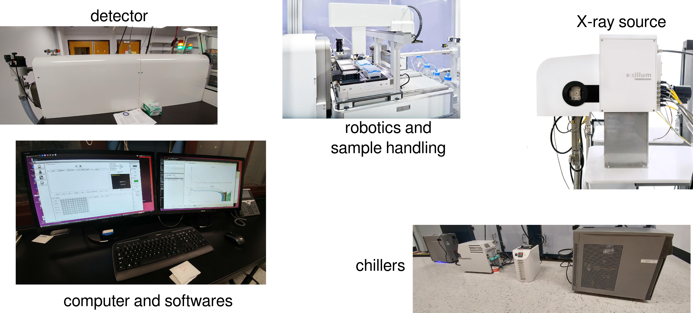
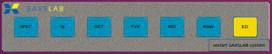
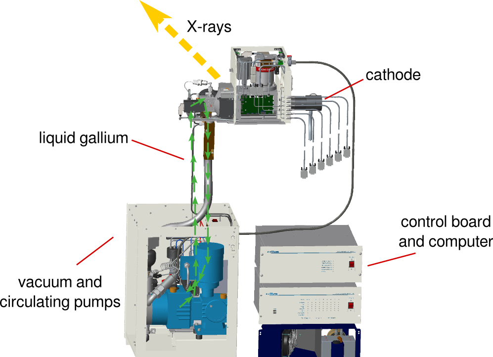
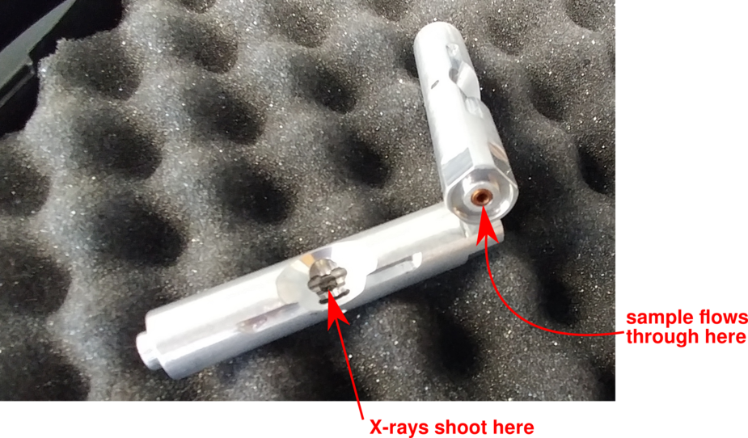
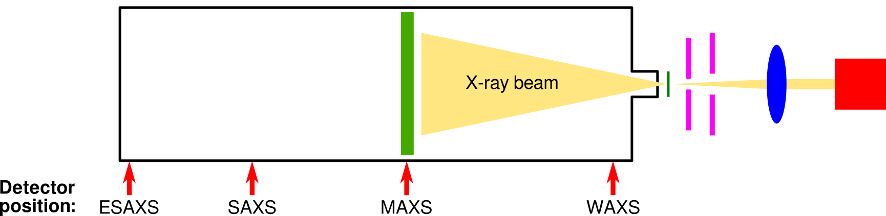

---
title: Overview of the instrumentation
author: Normand Cyr
date: 2020-04-17
...

# Overview of the instrumentation

The SAXSLAB Bio-Nordic is equipped with a vacuum GANESHA platform which enables the measurement of X-rays scattering at small angles for vectors of momentum transfer (\(q\)-values) from 0.0006 to 3.4 \(Å^{-1}\), for both SAXS (small angle) and WAXS (wide angle) applications, for particles up to 120 nm in diameter.

## Parts of the SAXS laboratory

## Software

Several pieces of software are in place in order to control the various pieces of the BioSAXS instrument. The toolbar to open them is located at the bottom of the screen and looks like the following:

Each button is responsible for opening a different software.

| Button | Software                                                  |
|--------|-----------------------------------------------------------|
| SPEC   | spec software for instrument control and data acquisition |
| SL     | detector data processing                                  |
| DET    | detector camera logging                                   |
| TVX    | detector control software                                 |
| BIO    | BioSAXS instrument control                                |
| RAW    | BioXtas RAW for data visualization and analysis           |
| ED     | `gedit` text editor                                       |

If a button is yellow, it means the software is closed, whereas a blue button indicates that the corresponding software is open. By clicking the blue-colored button, you will be directed to the corresponding window.

*Note: in case that the toolbar is not present, it can be opened manually by clicking on the `Ganesha System Control Panel` on the desktop.*

Details about the various windows can be found [here](details_instrument_software.md).

## X-ray source

X-rays are generated by a [Excillum MetalJet D2+ 70 kV](https://www.excillum.com/products/metaljet-sources/metaljet-d2-70-kv/) generator. A metal-jet-anode microfocus X-ray tube is used where a liquid gallium alloy recirculates (ExAlloy G1, 95% Ga, \(\lambda\) = 1.34 Å).

Source: [Excillum](https://www.excillum.com)

It delivers a superior brightness when compared to conventional rotating anode X-ray sources thus enabling faster data acquisition times. In out laboratory, the beam size is set to 20 \(\mu\)m, thus delivering 250 W of power.

## Sample capillary

A sample capillary is installed in the flow path of the liquid handling system. Under normal conditions, there should not need any manipulation of the capillary by the user.

## Detector

The Bio-Nordic is equipped with a Dectris hybrid photon counting detector ([PILATUS3 R 300K](https://www.dectris.com/products/pilatus3/pilatus3-r-for-laboratory/details/pilatus3-r-300k)) offering micrometric spacial resolution (172 \(\mu\)m x 172 \(\mu\)m) and a wide dynamic range. The detector is water-cooled and installed in a vacuum chamber therefore eliminating air scattering.

### Positioning of the detector

The detector is installed on rails and can therefore be positioned at any desired distance from the sample. The current detector configurations available are listed in the table below.

| Config name | # |      description      | sample-detector distance, mm | q-range, \(Å^{-1}\) | D-range, Å |
|-------------|:-:|:---------------------:|:----------------------------:|:-------------------:|:----------:|
| WAXS_INT    | 1 |       wide angle      |              80              |     0.0505-3.4451   |    2-120   |
| MAXS_INT    | 2 |      medium angle     |              600             |     0.0107-0.5807   |   10-580   |
| SAXS_INT    | 3 |      small angle      |             1022             |     0.0071-0.3438   |   20-880   |
| ESAXS_INT   | 4 | extremely small angle |             1418             |     0.0051-0.2491   |   25-1200  |

## Liquid handling robot

A high-throughput robot installed on the Bio-Nordic enables screening refrigerated 96-well plates by automating liquid handling. Less than 20 \(\mu\)l is required per sample.
