---
title: SEC-SAXS data analysis in RAW
author: Normand Cyr
date: 2020-04-17
...

Currently in developement. Another RAW tutorial describes well the process. You can visit the tutorial here: [https://bioxtas-raw.readthedocs.io/en/latest/tutorial/s1_sec.html](https://bioxtas-raw.readthedocs.io/en/latest/tutorial/s1_sec.html).

# SEC-SAXS data analysis

If you followed appropriately the steps presented in the [SEC-SAXS setup](sec-saxs_setup.md) section, you should have collected hundreds of images (likely between 100 and 200 frames).

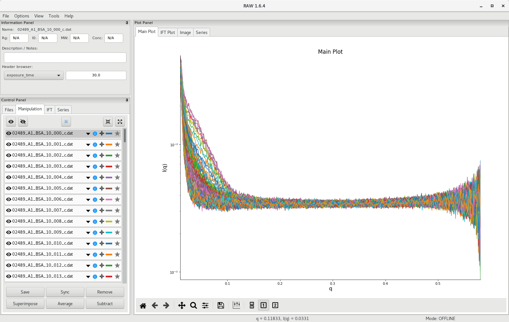

## Plotting the data

The first step involves creating a scattergram, where total scattering intensity will be plotted against frame number. To do so, go to the `Files` tab and select all the processed scattering profiles from the SEC-SAXS run. In the tutorial dataset, there are 372 files. Then click on `Plot Series`.

RAW will calculate the total scattering intensity from each data file and generate a plot against frame number. The scattergram will appear in the `Series` tab of the plot panel.

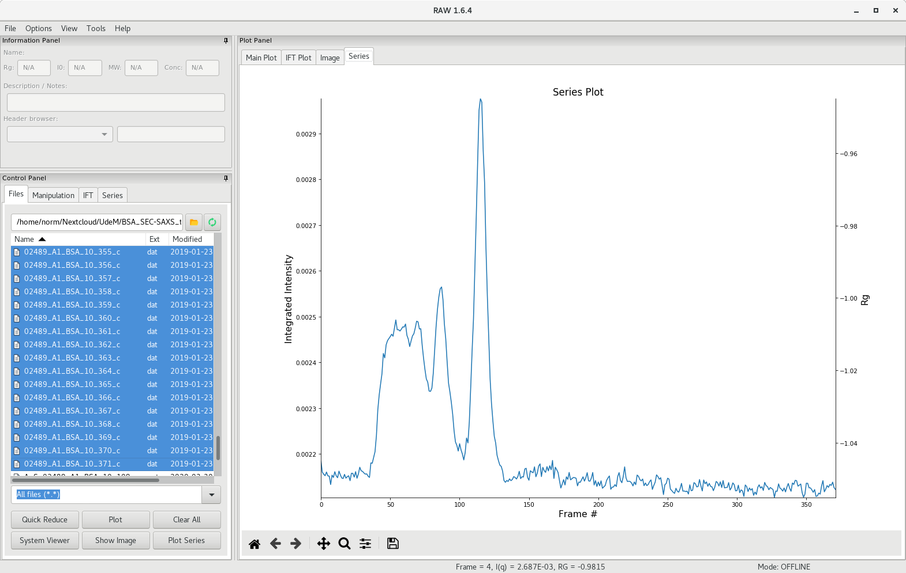

## Selecting the buffer region

In the control panel, select the `Series` tab and right-click on the series file. You can now save the series file, or continue with the analysis. Choose the `LC Series analysis`, which will open up a new window with additional tools. First, the unsubtracted profile is presented.

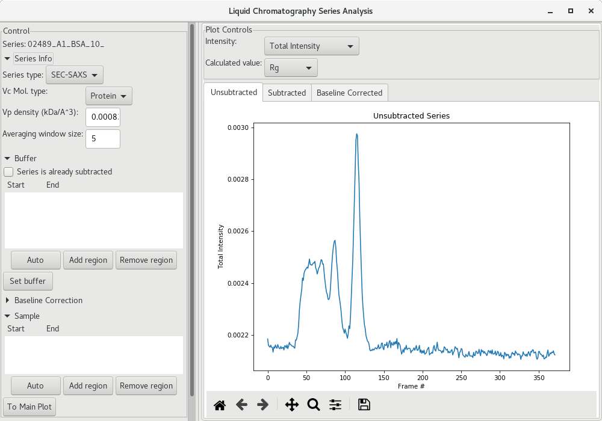

We now need to select the region that will be used for buffer subtraction.  As a starting point, click on the `Auto` button under the Buffer section and see on the scattergram where it was selected (within the green shadow). It may not be optimal, so please inspect it carefully, and adjust if needed.

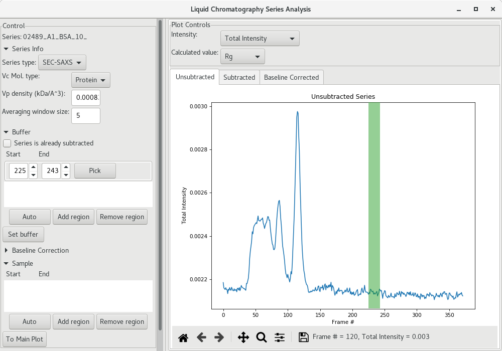

On satisfied with the buffer region, click on `Set buffer` to set the buffer region. At this point, an average SAXS profile from the buffer region will be used to subtract the buffer from all SAXS profiles recorded and [AutoRG](basic_data_processing.md#guinier-plot-in-raw) will be performed to try to determine a \(R_g\) and a \(I_0\) at each frame point (along with the corresponding molecular weight using both the \(V_c\) and \(V_p\) [methods](basic_data_processing.md#molecular-weight-analysis)). The \(R_g\) data is then plotted for each frame (red filled circles here).

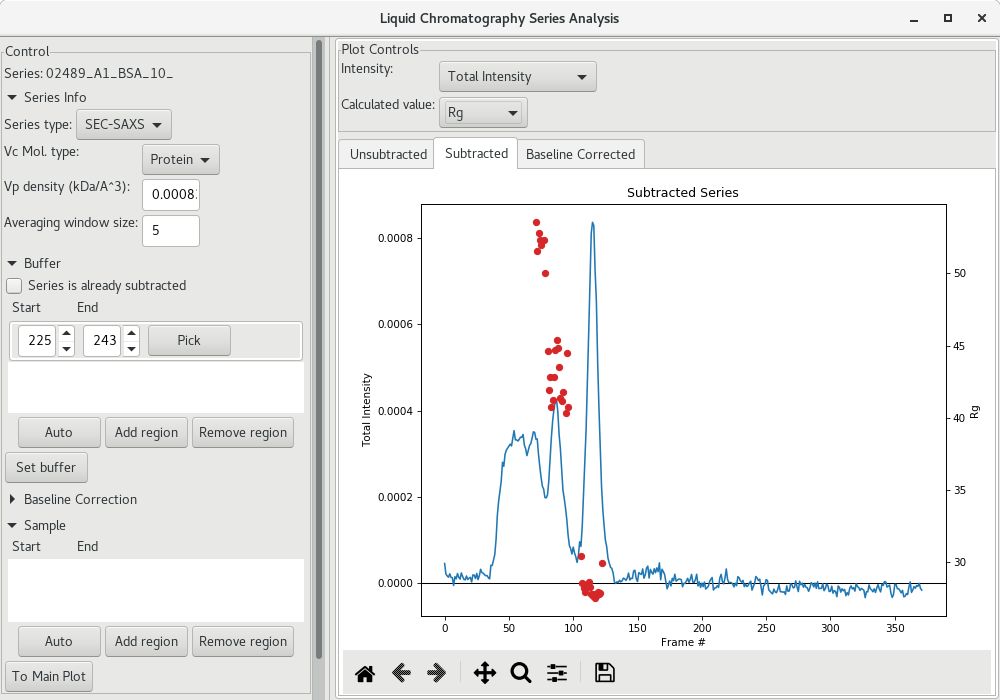

## Selection the sample region

Once the \(R_g\) for each frame has been determined, you can use the magnifying lens to zoom into the region of interest to inspect further the results:

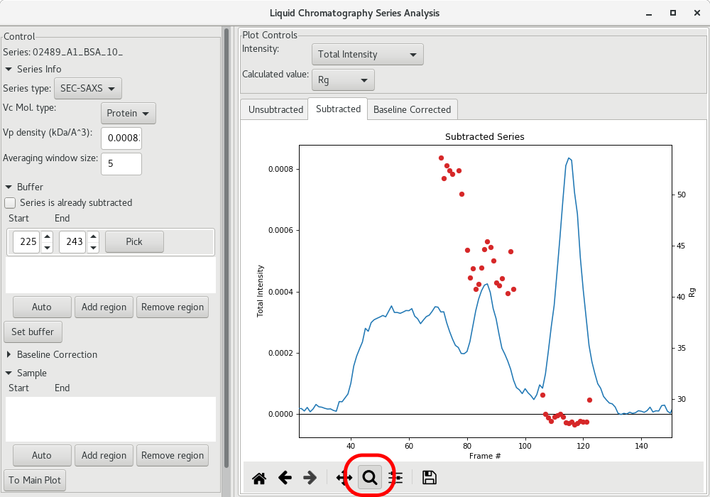

The next step is to get a buffer-subtracted SAXS profile corresponding to the elution peak (BSA monomer in the present case). To do so, click on the `Auto` button of the Sample section. The selected frames will be highlighted in green.

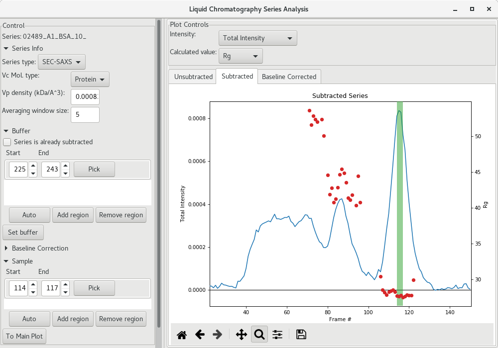

This could be sufficient, or you may want to enlarge the region using the arrows for the start and end frames. I suggest, if the Guinier analysis was acceptable, to select the frames corresponding to the intensities starting and ending at about half-height of the peak (corresponding here to frames 110 to 120).

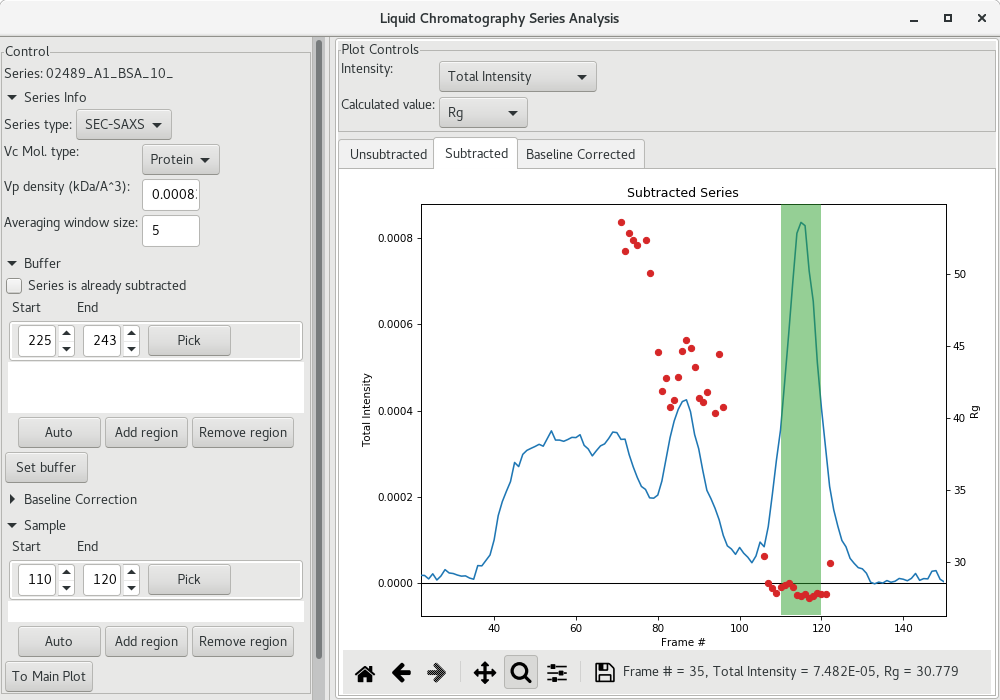

Then the average subtracted data can be plot by clicking on `To Main Plot`. Here, we can see that there is no significant data beyond \(q\) of 0.3 \(Å^{-1}\) so we can discard that data at high \(q\).

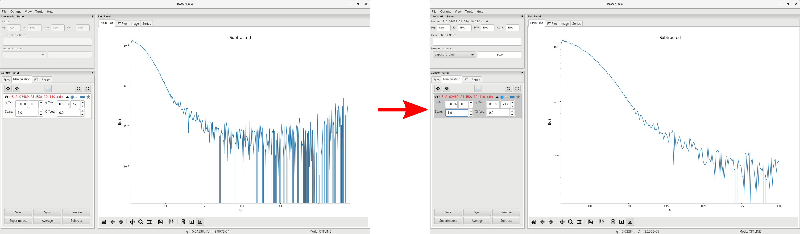

Additional data processing follow the standard procedure for the [Guinier analysis](basic_data_processing.md#guinier-analysis) and the [pairwise distribution](advanced_data_processing.md#pairwise-distribution) (*ie* GNOM or BIFT).

Make sure to save your SAXS profile data (see [here](basic_data_processing.md#buffer-subtraction)) and your series data by selecting the file name and clicking on `Save`. You should save the SEC-SAXS scattergram data under

`<project_name>/processed_data/series/`

## Baseline correction

It is possible that you observe small linear baseline drifts over the course of the SEC-SAXS run. RAW enables you to correct for it via the `Baseline Correction` section of the LC Series analysis window. Select a group of frames from the beginning and from the end of the run and click on `Set baseline and calculate`.

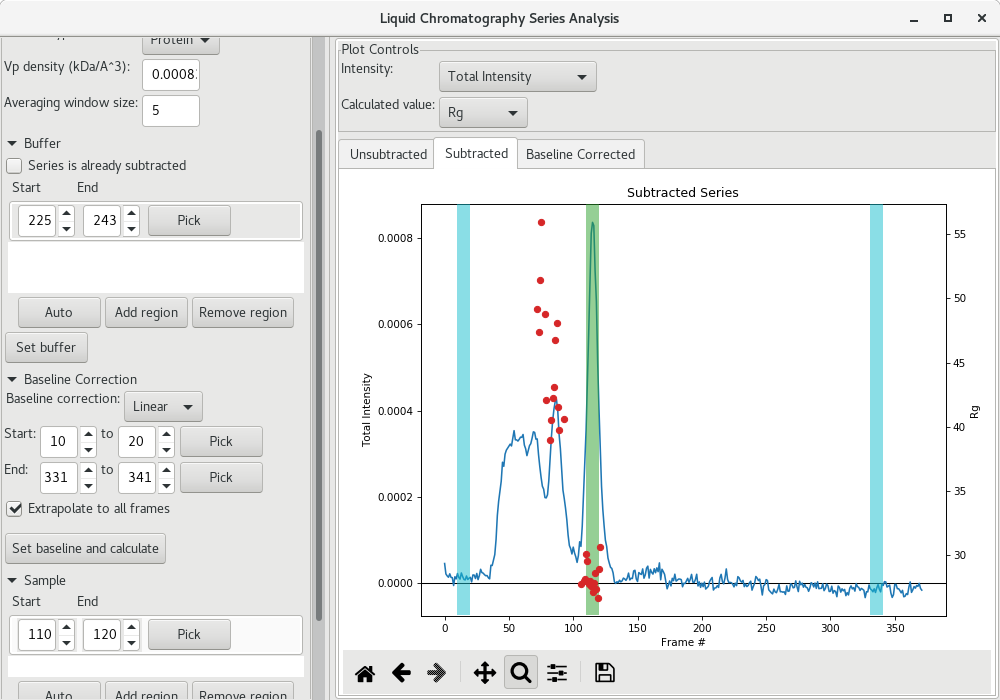

The baseline corrected scattergram will open in the `Baseline corrected` tab. If you go back to the `Subtracted` tab, you'll see how the correction was applied.

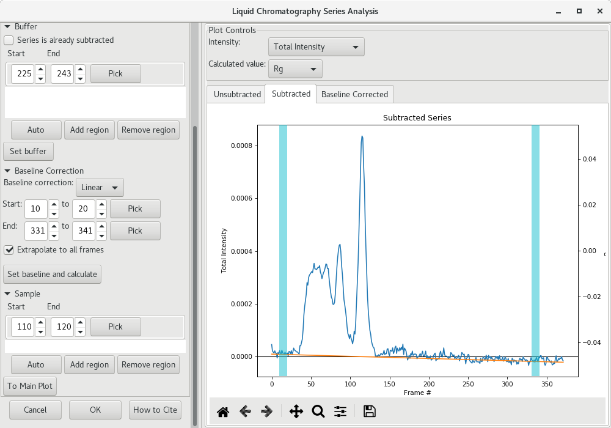

You can then send the corrected average scattering profile to the `Main plot` by clicking on `To Main Plot`. Repeat the standard procedure for the [Guinier analysis](basic_data_processing.md#guinier-analysis) and the [pairwise distribution](advanced_data_processing.md#pairwise-distribution) (*ie* GNOM or BIFT). Compare the results between the uncorrected pairwise distribution (left) and baseline corrected one (right). Improvements may be minor.

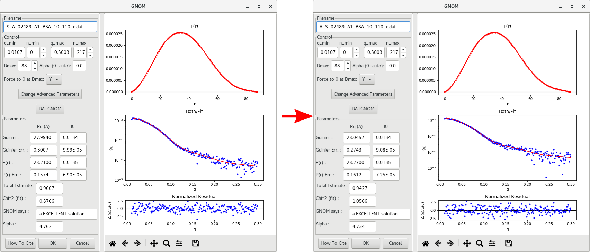
